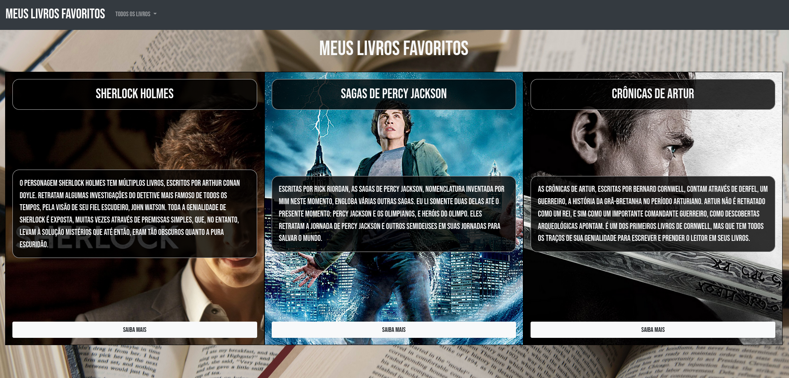

# Meus Livros Favoritos :book:

* Projeto desenvolvido para o curso CC50 da Fundação Estudar e Harvard, no módulo Web :computer:

* Neste projeto, utilizei HTML, CSS, JavaScript e Bootstrap

* É uma lista dos meus livros favoritos :books:

* Utilizei a API da Wikipedia para prover uma descrição, uma imagem e um link para a própria página da Wikipedia do Livro

* Você pode acessá-lo <a href="https://doglasrocha.github.io/meus-livros/favoritos" target="_blank">aqui</a>

* Imagem do projeto:

  ​	